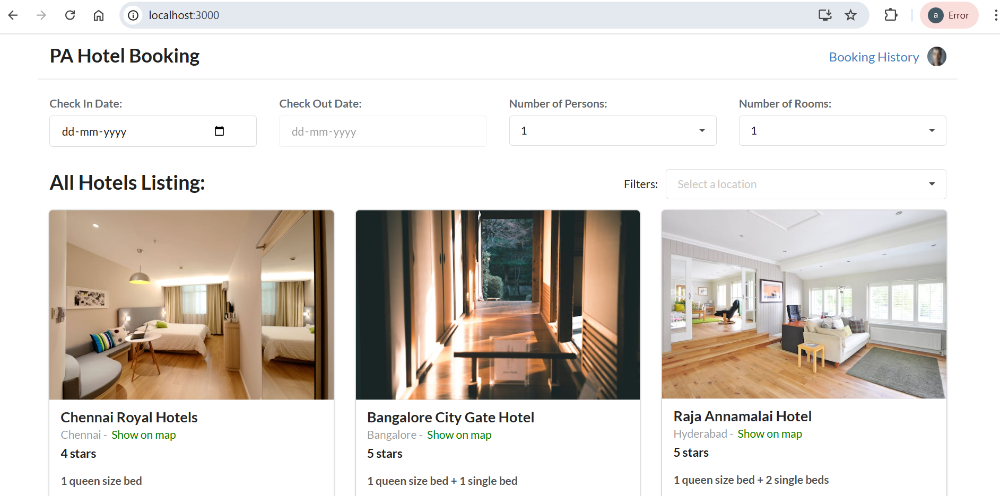
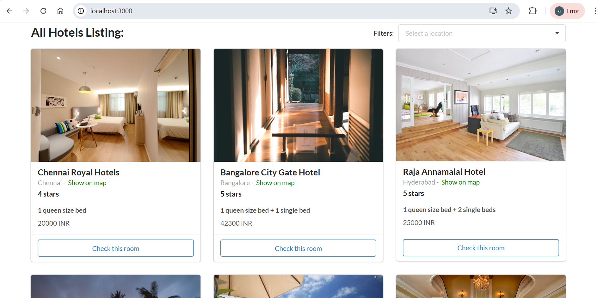
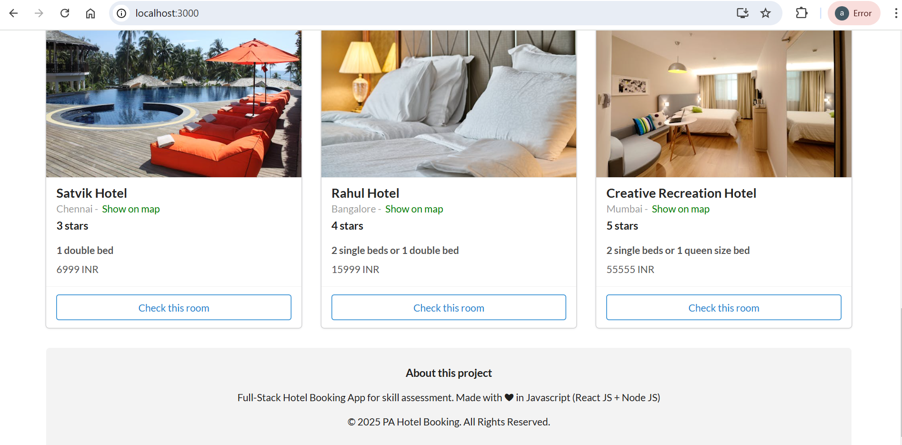
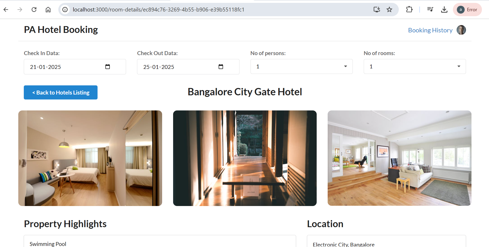
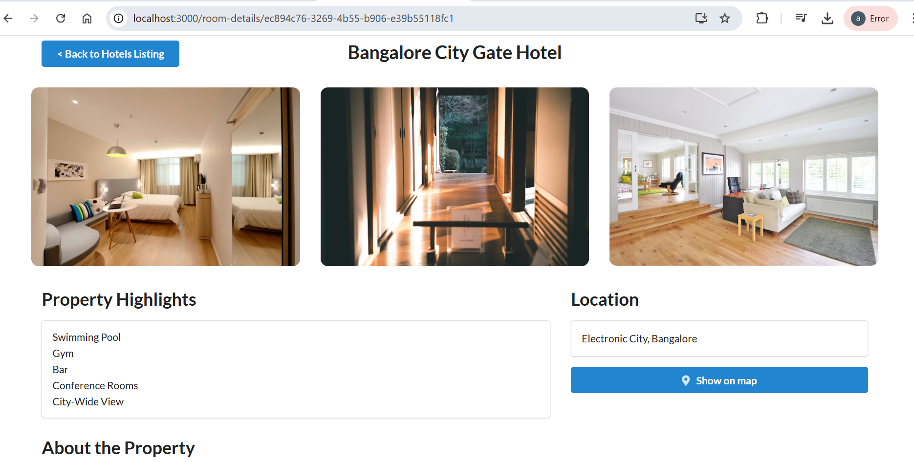
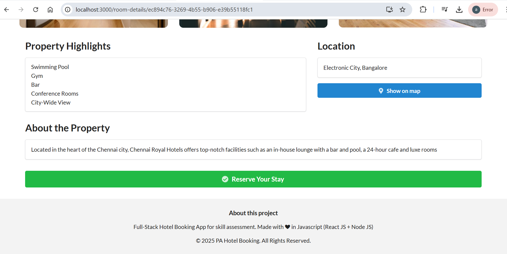
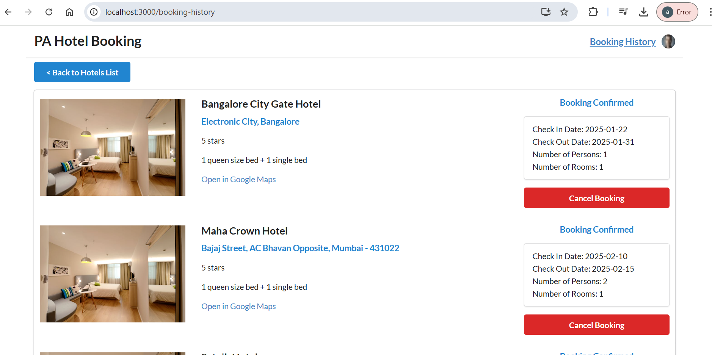

# PA Hotel Booking App

Simple Full-Stack application to book hotels

## Technologies Used

Frontend - React JS
Backend - Node JS
Database - Low DB

## Project Structure 

Project repo has 2 folders 

1. `client` - Represents the client-side app
2. `server` - Represents the server-side app 

Both the applications are maintained separately. 

- Use `npm install` to install the dependencies in each of the modules 
- Use `npm start` to run both client and server code separately. 

## Client-Side Pages 

There are 3 main pages in the client-side 

- Hotels listing page
- Hotel details page
- Hotels booking history page

## User Actions & Validations

- Filter hotels based on location
- Select check in date, check out date, number of persons and rooms required 
- Reserve a hotel 
- Cancel a hotel booking
- Google Maps link for each hotel location
- Once the hotel is booked/cancelled, a toast message notification will be displayed to the user
- Static images in `public` folder are used to display the hotel images

- Allow reservation of a hotel room only when check in and check out dates are selected 
- The check out date will always be greater than the check in date 
- Once a hotel room booking is cancelled, the booking history will be updated instantly
- DB and UI are in sync based on user actions
- Client-side filtering of hotels based on location

## Server-Side Features 

API endpoints - 

- GET - returns all hotels 
- GET - return a hotel object based on the `id`
- GET - return all booked hotels
- POST - create a new hotel using the request body 
- PUT - update the booking status and details (booking / cancelled)
- DELETE - delete a hotel based on the `id`

## UI Screenshots 

#### Hotels Losting Page Screenshot 1 

#### Hotels Losting Page Screenshot 2

#### Hotels Losting Page Screenshot 3

#### Hotel Details Page Screenshot 1

#### Hotel Details Page Screenshot 2

#### Hotel Details Page Screenshot 3

#### Hotel Booking History Page

